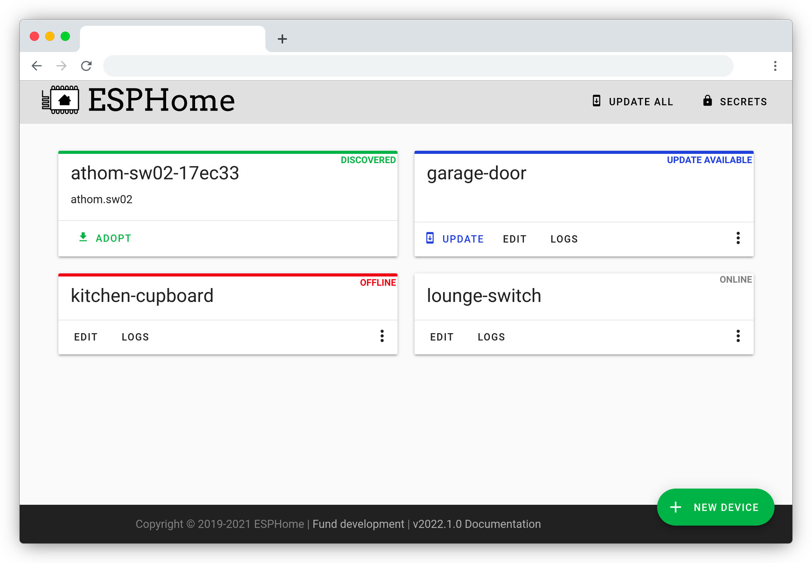

# ESPHome Native API Binding


This binding makes [ESPHome](https://esphome.io) devices available in openHAB through the ESPHome Home Assistant Native
API. This is an
alternative to using MQTT and/or running Home Assistant in addition to openHAB.

It does _NOT_ provide any webpage for managing the ESP themselves. Use
the [ESPHome dashboard](https://esphome.io/guides/installing_esphome.html) for that.



Benefits of using the native API over MQTT:

- Very tight integration with openHAB, state patterns, options, icons etc fully integrated
- Robust and reliable communication - 2 way keep-alive pings at fairly short intervals lets you know if the device has
  gone offline
- No need for an MQTT broker (but that is nice to have anyway for other things :))
- Slightly faster than messaging over MQTT (according to the ESPHome documentation)

Read more here: https://esphome.io/components/api#advantages-over-mqtt

## Getting started for non ESPHome users

1. [Install ESPHome](https://esphome.io/guides/installing_esphome)
2. Create an ESPHome configuration for your device
3. Flash the device with the ESPHome firmware
4. Install the openHAB ESPHome binding by copying the jar file
   here https://github.com/seime/openhab-esphome/releases/tag/latest_oh4 into your `addons` folder, or by installing
   from the Marketplace https://community.openhab.org/t/esphome-binding-for-the-native-api/146849
5. Wait for discovery to find your device - or add manually in a thing file.

> **Note:** At the current state of the binding, it is highly recommended to use file based configuration for things and
> items as channel types etc most likely will change.

## Streaming device logs

As an alternative to manually streaming device logs via ESPHome dashboard, you can have openHAB stream
the device logs directly to openHAB - which will write them using the standard log system.

1. Make sure your ESPHome yaml is configured with a log level that produces the logs you want to see.
   See https://esphome.io/components/logger.html
2. Configure the `deviceLogLevel` parameter on the `thing` configuration. Valid
   values: https://esphome.io/components/logger.html#log-levels
3. The default log level in openHAB is `WARN`, so you need to add a logger named `ESPHOMEDEVICE`with level `INFO` to see
   actual log statements. Either add this to your `log4j.xml` file or use the Karaf console:

```
log:set INFO ESPHOMEDEVICE
```

**or**

```xml

<Loggers>
    ...
    <Logger level="DEBUG" name="ESPHOMEDEVICE"/>
</Loggers>
```

This will produce logs on level `INFO` in the openHAB logs like this:

```
[2024-04-04 15:06:25.822] [varmtvann] [D][dallas.sensor:143]: 'VV Temp bunn': Got Temperature=21.0°C
[2024-04-04 15:06:25.834] [varmtvann] [D][sensor:094]: 'VV Temp bunn': Sending state 21.00000 °C with 1 decimals of accuracy
[2024-04-04 15:06:25.850] [varmtvann] [D][dallas.sensor:143]: 'VV Temp midt': Got Temperature=71.7°C
[2024-04-04 15:06:25.863] [varmtvann] [D][sensor:094]: 'VV Temp midt': Sending state 71.68750 °C with 1 decimals of accuracy
```

To redirect device logs to a separate log file, edit your `log4j.xml` file and add the following in the `Appenders`
section:

```xml

<RollingFile fileName="${sys:openhab.logdir}/esphomedevice.log"
             filePattern="${sys:openhab.logdir}/esphomedevice.log.%i" name="ESPHOMEDEVICE">
    <PatternLayout pattern="[%d{yyyy-MM-dd HH:mm:ss.SSS}] %m%n"/>
    <Policies>
        <SizeBasedTriggeringPolicy size="32 MB"/>
    </Policies>
</RollingFile>
```

And add the following in the `Loggers` section:

```xml

<Logger additivity="false" level="INFO" name="ESPHOMEDEVICE">
    <AppenderRef ref="ESPHOMEDEVICE"/>
</Logger>
```

## Sending state from openHAB to ESPHome

You can send state to the ESPHome device using the `homeassistant` channel type. Only `entity_id` field is used.

You can listen for several types of OpenHAB events, default is `ItemStateChangedEvent`. The following are supported:

| entity_id                                  | OH Event listened for         | Item/Thing   |
|--------------------------------------------|-------------------------------|--------------|
| `<whatever>.ItemName`                      | `ItemStateChangedEvent`       | ItemName     | 
| `ItemStateChangedEvent.ItemName`           | `ItemStateChangedEvent`       | ItemName     | 
| `ItemStateEvent.ItemName`                  | `ItemStateEvent`              | ItemName     | 
| `ItemStatePredictedEvent.ItemName`         | `ItemStatePredictedEvent`     | ItemName     | 
| `ThingStatusInfoEvent.my_thing_uid`        | `ThingStatusInfoEvent`        | my:thing:uid | 
| `ThingStatusInfoChangedEvent.my_thing_uid` | `ThingStatusInfoChangedEvent` | my:thing:uid | 

> NOTE: EntityID in HA is case-insensitive - meaning only lowercase is used. Whatever you add in `entity_id` in the
> ESPHome yaml will be converted to lowercase.
> In OH item names are case-sensitive, so you > can have 2 items like `MYITEM` and `MyItem`, and we cannot distinguish
> between the 2. Avoid this setup.

> NOTE2: In Thing UIDs, the `:` is replaced with `_`

### Examples

Making state changes to OH temperature sensor available in ESPHome:

```yaml
sensor:
  - platform: homeassistant
    name: "Outside temperature"
    entity_id: ItemStateChangedEvent.MyTemperatureItem
    device_class: temperature
```

Listening for commands sent from OH to some OH item and making it available in ESPHome:

```yaml
binary_sensor:
  - platform: homeassistant
    name: "Flower watering activating"
    entity_id: ItemCommandEvent.WaterValve_Switch
```

Making ESPHome device react when a Thing changes status, ie goes offline/online:

```yaml
text_sensor:
  - platform: homeassistant
    name: "ThingStatusInfoChangedEvent"
    entity_id: ThingStatusInfoChangedEvent.astro_moon_local
```

## Time sync

Time sync from your openHAB server is supported using
the [HomeAssistant time source component](https://esphome.io/components/time/homeassistant).

```yaml
time:
  - platform: homeassistant
    id: openhab_time
```

## Iconify support

If you have
the [Iconify icon provider bundle installed](https://community.openhab.org/t/iconify-icon-provider-4-0-0-0-5-0-0-0/149990),
try configuring the `icon` field in the ESPHome yaml file. The binding will then use the icon from Iconify instead of
[ openHAB classic icons ](https://www.openhab.org/docs/configuration/iconsets/classic/).

  ```yaml
sensor:
  - platform: uptime
    name: Uptime
    icon: "mdi:counter"
```

## FAQ

- I get warnings
  like `No device_class reported by sensor '<name of sensor>'. Add device_class to sensor configuration in ESPHome. Defaulting to plain Number without dimension`

  > This is because the ESP sensor does not report a `device_class`. This field is used to determine item and category
  > type in openHAB.
  > Solution: Specify a `device_class` to your ESPHome configuration. Example: <br/>
  > 
  > <br/>See https://developers.home-assistant.io/docs/core/entity/sensor/#available-device-classes for valid
  device_class values (**use lowercase values**)
  > Also note that you may override default device_class by specifying `device_class: ""` to remove any device class
  from the sensor.

Also see https://community.openhab.org/t/esphome-binding-for-the-native-api/146849/1 for more information.

## Limitations as of 2024-06-17

Most entity types and functions are now supported. However, there are some limitations:

The following entity types are **not** yet supported (please submit a PR of file a feature request!)

- `lock`,
- `camera`
- `voice`
- `valve`

In addition, the Bluetooth proxy isn't ready yet.

## Discovery

The binding uses mDNS to automatically discover devices on the network.

## Thing Configuration

### `device` Thing Configuration

| Name              | Type      | Description                                                                                                                            | Default  | Required | Advanced |
|-------------------|-----------|----------------------------------------------------------------------------------------------------------------------------------------|----------|----------|----------|
| `hostname`        | `text`    | Hostname or IP address of the device. Typically something like 'myboard.local'                                                         | N/A      | yes      | no       |
| `port`            | `integer` | IP Port of the device                                                                                                                  | 6053     | no       | no       |
| `encryptionKey`   | `text`    | Encryption key as defined in `api: encryption: key: <BASE64ENCODEDKEY>`. See https://esphome.io/components/api#configuration-variables | N/A      | no       | no       |
| ~~`password`~~    | `text`    | Password to access the device if password protected. **DEPRECATED. Use `encryptionKey` instead**                                       | N/A      | no       | no       |
| `pingInterval`    | `integer` | Seconds between sending ping requests to device to check if alive                                                                      | 10       | no       | yes      |
| `maxPingTimeouts` | `integer` | Number of missed ping requests before deeming device unresponsive.                                                                     | 4        | no       | yes      |
| `server`          | `text`    | Expected name of ESPHome. Used to ensure that we're communicating with the correct device                                              |          | no       | yes      |
| `logPrefix`       | `text`    | Log prefix to use for this device.                                                                                                     | hostname | no       | yes      |
| `deviceLogLevel`  | `text`    | ESPHome device log level to stream from the device.                                                                                    | NONE     | no       | yes      |

## Channels

Channels are auto-generated based on actual device configuration.

## Full Example

### Thing Configuration

```
esphome:device:esp1  "ESPHome Test card 1" [ hostname="testkort1.local", encryptionKey="JVWAgubY1nCe3x/5xeyMBfaN9y68OOUMh5dACIeVmjk=", pingInterval=10, maxPingTimeouts=4, server="esphomename", logPrefix="esp1", deviceLogLevel="INFO"]
```

### Item Configuration

```
Number:Temperature ESP1_Temperature "Temperature" <temperature>   {channel="esphome:device:esp1:temperature"}
Number:Dimensionless ESP1_Humidity "Humidity"     <humidity>      {channel="esphome:device:esp1:humidity"}
Switch ESP1_Switch "Relay"                        <switch>        {channel="esphome:device:esp1:relay_4"}
```
